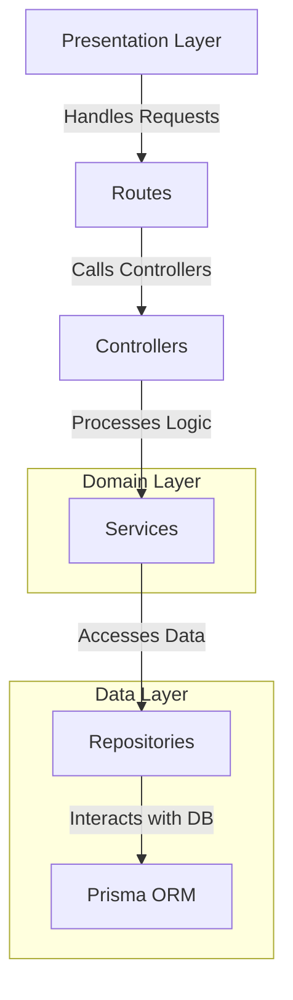
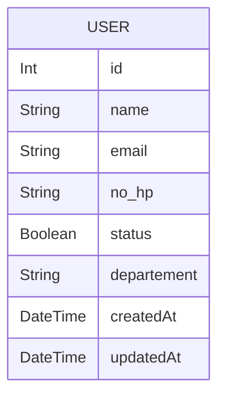

# Skill Test Backend MiniLemon

This is the backend for a note-taking application built with Express.js.

This project follows a clean architecture approach, which aims to separate concerns and create a maintainable and scalable codebase. Here's a brief explanation of the structure:

NOTE: Implementing hard delete as per test requirements.
In a production environment, a soft delete approach (e.g., setting an 'is_deleted' flag or a 'deleted_at' timestamp)
Would be the preferred best practice for data recovery and audit trail purposes.

## Architecture:



### 📁 Project Structure

This project follows a clean and organized structure, ensuring maintainability and scalability. Below is an overview of the main directories and files:

### 📂 Root Directories

- **`api/`** - Entry point for the API, responsible for initializing and configuring the server.
- **`prisma/`** - Contains database schema and migration files.
- **`public/`** - Serves static files used by the application.
  - **`swagger-ui/`** - Assets for API documentation using Swagger UI.
- **`src/`** - Main source code directory.

### 📂 Source Code (`src/`)

#### 🏗️ Architecture Layers

- **`controllers/`** - Handles HTTP requests and responses.
- **`routes/`** - Defines API endpoints and connects them to controllers.
- **`services/`** - Contains business logic and core application functionality.
- **`repositories/`** - Manages database operations and interactions.
- **`models/`** - Defines data structures and database models.

#### 🔧 Supporting Modules

- **`utils/`** - Utility functions to support the application.
- **`types/`** - TypeScript type definitions for better type safety.
- **`docs/`** - OPEN API documentation.

## 🛠️ Configuration Files

- **`package.json`** - Project manifest file.
- **`tsconfig.json`** - TypeScript configuration file.
- **`vercel.json`** - Configuration for deployment on Vercel.

## 📝 Dokumentasi API

Ini adalah dokumentasi singkat untuk Users API, sebuah layanan untuk mengelola data pengguna.

Untuk dokumentasi yang lebih detail dan interaktif, silakan kunjungi halaman Swagger kami:
[Lihat Dokumentasi Swagger](http://localhost:8080/api-docs/)

### Base URL

Semua endpoint API di bawah ini menggunakan URL dasar berikut:

https://skill-test-be-minilemon.vercel.app/api

### Endpoints

Berikut adalah daftar endpoint yang tersedia:

1. Mendapatkan Semua Pengguna
   Deskripsi: Mengambil daftar semua pengguna yang ada di sistem.

Method: GET

Endpoint: /users

Contoh cURL:
curl -X GET 'https://skill-test-be-minilemon.vercel.app/api/users' \

2. Membuat Pengguna Baru
   Deskripsi: Mendaftarkan seorang pengguna baru ke dalam sistem.

Method: POST

Endpoint: /users

Request Body: (application/json)

JSON
{
"name": "John Doe",
"email": "john.doe@example.com",
"no_hp": "081234567890",
"status": true,
"departement": "Technology"
}

Contoh cURL:
curl -X POST 'https://skill-test-be-minilemon.vercel.app/api/users' \
-H 'Content-Type: application/json' \
-d '{
"name": "John Doe",
"email": "john.doe@example.com",
"no_hp": "081234567890",
"status": true,
"departement": "Technology"
}'

3. Mendapatkan Pengguna Berdasarkan ID
Deskripsi: Mengambil detail satu pengguna spesifik berdasarkan ID-nya.

Method: GET

Endpoint: /users/{id}

Path Parameters:

id (integer): ID unik dari pengguna.

Contoh cURL:
curl -X GET 'https://skill-test-be-minilemon.vercel.app/api/users/1' \

Tentu. Saya akan mengambil isi README Anda yang sudah ada dan mengganti bagian ## API Endpoints yang sederhana dengan dokumentasi yang lebih lengkap dan terstruktur berdasarkan file swagger.json Anda.

Berikut adalah isi file README.md Anda yang sudah diperbarui:

Skill Test Backend MiniLemon
This is the backend for a note-taking application built with Express.js.

This project follows a clean architecture approach, which aims to separate concerns and create a maintainable and scalable codebase. Here's a brief explanation of the structure:

NOTE: Implementing hard delete as per test requirements.
In a production environment, a soft delete approach (e.g., setting an 'is_deleted' flag or a 'deleted_at' timestamp)
Would be the preferred best practice for data recovery and audit trail purposes.

Architecture:
Cuplikan kode

graph TD
    A[Presentation Layer] -->|Handles Requests| B[Routes]
    B -->|Calls Controllers| C[Controllers]
    C -->|Processes Logic| D[Services]
    D -->|Accesses Data| E[Repositories]
    E -->|Interacts with DB| F[Prisma ORM]

    subgraph Domain Layer
        D
    end

    subgraph Data Layer
        E
        F
    end
📁 Project Structure  
This project follows a clean and organized structure, ensuring maintainability and scalability. Below is an overview of the main directories and files:  

📂 Root Directories  
api/ - Entry point for the API, responsible for initializing and configuring the server.  

prisma/ - Contains database schema and migration files.  

public/ - Serves static files used by the application.  

swagger-ui/ - Assets for API documentation using Swagger UI.  

src/ - Main source code directory.  

📂 Source Code (src/)  
🏗️ Architecture Layers  
controllers/ - Handles HTTP requests and responses.  

routes/ - Defines API endpoints and connects them to controllers.  

services/ - Contains business logic and core application functionality.  

repositories/ - Manages database operations and interactions.  

models/ - Defines data structures and database models.  

🔧 Supporting Modules  
utils/ - Utility functions to support the application.  

types/ - TypeScript type definitions for better type safety.  

docs/ - OPEN API documentation.

🛠️ Configuration Files  
package.json - Project manifest file.

tsconfig.json - TypeScript configuration file.  

vercel.json - Configuration for deployment on Vercel.  

📝 Dokumentasi API
Ini adalah dokumentasi singkat untuk Users API, sebuah layanan untuk mengelola data pengguna.

Untuk dokumentasi yang lebih detail dan interaktif, silakan kunjungi halaman Swagger kami:
Lihat Dokumentasi Swagger

Base URL
Semua endpoint API di bawah ini menggunakan URL dasar berikut:

https://skill-test-be-minilemon.vercel.app/api
🔑 Autentikasi
Sebagian besar endpoint memerlukan autentikasi menggunakan Bearer Token (JWT). Sertakan token Anda pada header Authorization untuk setiap permintaan.

Contoh Header:

Authorization: Bearer <YOUR_JWT_TOKEN>
Endpoints
Berikut adalah daftar endpoint yang tersedia:

1. Mendapatkan Semua Pengguna
Deskripsi: Mengambil daftar semua pengguna yang ada di sistem.

Method: GET

Endpoint: /users

Headers: Authorization: Bearer <TOKEN> (Wajib)

Contoh cURL:

Bash

curl -X GET 'https://skill-test-be-minilemon.vercel.app/api/users' \
-H 'Authorization: Bearer <YOUR_JWT_TOKEN>'
2. Membuat Pengguna Baru
Deskripsi: Mendaftarkan seorang pengguna baru ke dalam sistem.

Method: POST

Endpoint: /users

Request Body: (application/json)

JSON

{
  "name": "John Doe",
  "email": "john.doe@example.com",
  "no_hp": "081234567890",
  "status": true,
  "departement": "Technology"
}
Contoh cURL:

Bash

curl -X POST 'https://skill-test-be-minilemon.vercel.app/api/users' \
-H 'Content-Type: application/json' \
-d '{
      "name": "John Doe",
      "email": "john.doe@example.com",
      "no_hp": "081234567890",
      "status": true,
      "departement": "Technology"
    }'

3. Mendapatkan Pengguna Berdasarkan ID
Deskripsi: Mengambil detail satu pengguna spesifik berdasarkan ID-nya.

Method: GET

Endpoint: /users/{id}

Path Parameters:

id (integer): ID unik dari pengguna.

Contoh cURL:

Bash

curl -X GET 'https://skill-test-be-minilemon.vercel.app/api/users/1' \

4. Memperbarui Pengguna
Deskripsi: Memperbarui data seorang pengguna spesifik berdasarkan ID-nya.

Method: PUT

Endpoint: /users/{id}

Path Parameters:

id (integer): ID unik dari pengguna yang akan diperbarui.

Request Body: (application/json)
{
  "name": "John Doe Updated",
  "email": "john.doe.new@example.com",
  "no_hp": "081111111111",
  "status": false,
  "departement": "Marketing"
}

curl -X PUT 'https://skill-test-be-minilemon.vercel.app/api/users/1' \
-H 'Authorization: Bearer <YOUR_JWT_TOKEN>' \
-H 'Content-Type: application/json' \
-d '{
      "name": "John Doe Updated",
      "status": false
    }'

5. Menghapus Pengguna
Deskripsi: Menghapus seorang pengguna spesifik dari sistem berdasarkan ID-nya.

Method: DELETE

Endpoint: /users/{id}

Path Parameters:

id (integer): ID unik dari pengguna yang akan dihapus.

Respons Sukses: 204 No Content (Tidak ada body respons).

Contoh cURL:
curl -X DELETE 'https://skill-test-be-minilemon.vercel.app/api/users/1' \

## Getting Started

### Prerequisites

- Node.js
- npm

### Installation

1. Clone the repository:

```sh
git clone https://github.com/christian-siahaan26/skill-test-be-minilemon
```

2. Navigate to the project directory:

```sh
cd skill-test-backend
```

3. Install dependencies:

```sh
npm install
```

### Database Setup

#### ERD



1. Migrate prisma database:

```sh
npx prisma migrate dev
```

### Running the Server

1. Start the development server:

```sh
npm start
```

## Contributing

Contributions are welcome! Please open an issue or submit a pull request.

## License

This project is licensed under the MIT License.
