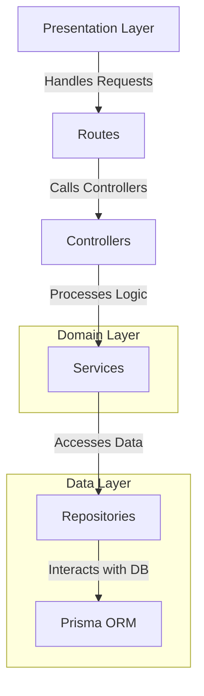
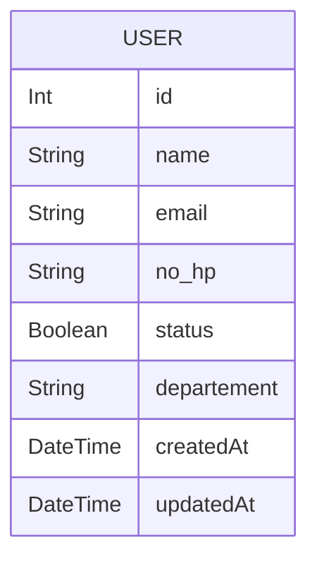

# Skill Test Backend MiniLemon

This is the backend for a note-taking application built with Express.js.

This project follows a clean architecture approach, which aims to separate concerns and create a maintainable and scalable codebase. Here's a brief explanation of the structure:

NOTE: Implementing hard delete as per test requirements.
In a production environment, a soft delete approach (e.g., setting an 'is_deleted' flag or a 'deleted_at' timestamp)
Would be the preferred best practice for data recovery and audit trail purposes.

## Architecture:


### 📁 Project Structure  

This project follows a clean and organized structure, ensuring maintainability and scalability. Below is an overview of the main directories and files:  

### 📂 Root Directories  
- **`api/`** - Entry point for the API, responsible for initializing and configuring the server.  
- **`prisma/`** - Contains database schema and migration files.  
- **`public/`** - Serves static files used by the application.  
  - **`swagger-ui/`** - Assets for API documentation using Swagger UI.  
- **`src/`** - Main source code directory.  

### 📂 Source Code (`src/`)  
#### 🏗️ Architecture Layers  
- **`controllers/`** - Handles HTTP requests and responses.  
- **`routes/`** - Defines API endpoints and connects them to controllers.  
- **`services/`** - Contains business logic and core application functionality.  
- **`repositories/`** - Manages database operations and interactions.  
- **`models/`** - Defines data structures and database models.  

#### 🔧 Supporting Modules   
- **`utils/`** - Utility functions to support the application.  
- **`types/`** - TypeScript type definitions for better type safety.  
- **`docs/`** - OPEN API documentation.

## 🛠️ Configuration Files  
- **`package.json`** - Project manifest file.
- **`tsconfig.json`** - TypeScript configuration file.  
- **`vercel.json`** - Configuration for deployment on Vercel.  

## 📚 Dokumentasi API
Ringkasan endpoint yang tersedia.
**Base URL:** `https://skill-test-be-minilemon.vercel.app/api`

<details>
<summary><code>GET /users</code> - <strong>Mendapatkan Semua Pengguna</strong></summary>

-   **Deskripsi:** Mengambil daftar semua pengguna yang ada di sistem.
-   **Headers:** `Authorization: Bearer <TOKEN>` (Wajib)

-   **Contoh Respons Sukses (`200 OK`)**
    ```json
    {
      "success": true,
      "message": "Users retrieved successfully",
      "data": [
        {
          "id": 1,
          "name": "John Doe",
          "email": "john.doe@example.com",
          "no_hp": "081234567890",
          "status": true,
          "departement": "Technology",
          "createdAt": "2025-07-08T10:00:00.000Z"
        }
      ],
      "meta": {
        "total": 1,
        "page": 1,
        "lastPage": 1,
        "hasNextPage": false,
        "hasPrevPage": false
      }
    }
    ```
-   **Contoh Respons Error (`400`/`500`)**
    ```json
    {
      "success": false,
      "message": "Error message description."
    }
    ```
</details>

<details>
<summary><code>POST /users</code> - <strong>Membuat Pengguna Baru</strong></summary>

-   **Deskripsi:** Mendaftarkan seorang pengguna baru ke dalam sistem.

-   **Request Body (`application/json`)**
    ```json
    {
      "name": "Jane Doe",
      "email": "jane.doe@example.com",
      "no_hp": "081234567891",
      "status": true,
      "departement": "Marketing"
    }
    ```
-   **Contoh Respons Sukses (`201 Created`)**
    ```json
    {
      "success": true,
      "message": "User created successfully",
      "data": {
        "id": 2,
        "name": "Jane Doe",
        "email": "jane.doe@example.com",
        "no_hp": "081234567891",
        "status": true,
        "departement": "Marketing",
        "createdAt": "2025-07-08T10:05:00.000Z"
      }
    }
    ```
-   **Contoh Respons Error (`400`/`500`)**
    ```json
    {
      "success": false,
      "message": "Error message description."
    }
    ```
</details>

<details>
<summary><code>GET /users/{id}</code> - <strong>Mendapatkan Pengguna Berdasarkan ID</strong></summary>

-   **Deskripsi:** Mengambil detail satu pengguna spesifik.
-   **Headers:** `Authorization: Bearer <TOKEN>` (Wajib)
-   **Path Parameter:** `id` (integer) - ID unik pengguna.

-   **Contoh Respons Sukses (`200 OK`)**
    ```json
    {
      "success": true,
      "message": "User retrieved successfully",
      "data": {
        "id": 1,
        "name": "John Doe",
        "email": "john.doe@example.com",
        "no_hp": "081234567890",
        "status": true,
        "departement": "Technology",
        "createdAt": "2025-07-08T10:00:00.000Z"
      }
    }
    ```
-   **Contoh Respons Error (`400`/`500`)**
    ```json
    {
      "success": false,
      "message": "Error message description."
    }
    ```
</details>

<details>
<summary><code>PUT /users/{id}</code> - <strong>Memperbarui Pengguna</strong></summary>

-   **Deskripsi:** Memperbarui data seorang pengguna spesifik.
-   **Headers:** `Authorization: Bearer <TOKEN>` (Wajib)
-   **Path Parameter:** `id` (integer) - ID unik pengguna.

-   **Request Body (`application/json`)**
    ```json
    {
      "name": "John Doe Updated",
      "status": false
    }
    ```
-   **Contoh Respons Sukses (`200 OK`)**
    ```json
    {
      "success": true,
      "message": "Success update user",
      "data": {
        "id": 1,
        "name": "John Doe Updated",
        "email": "john.doe@example.com",
        "no_hp": "081234567890",
        "status": false,
        "departement": "Technology",
        "createdAt": "2025-07-08T10:00:00.000Z"
      }
    }
    ```
-   **Contoh Respons Error (`400`/`500`)**
    ```json
    {
      "success": false,
      "message": "Error message description."
    }
    ```
</details>

<details>
<summary><code>DELETE /users/{id}</code> - <strong>Menghapus Pengguna</strong></summary>

-   **Deskripsi:** Menghapus pengguna spesifik dari sistem.
-   **Headers:** `Authorization: Bearer <TOKEN>` (Wajib)
-   **Path Parameter:** `id` (integer) - ID unik pengguna.

-   **Contoh Respons Sukses (`204 No Content`)**
    -   Body respons kosong.
-   **Contoh Respons Error (`400`/`500`)**
    ```json
    {
      "success": false,
      "message": "Error message description."
    }
    ```
</details>

## Getting Started

### Prerequisites

- Node.js
- npm

### Installation

1. Clone the repository:

```sh
git clone https://github.com/christian-siahaan26/skill-test-be-minilemon
```

2. Navigate to the project directory:

```sh
cd skill-test-backend
```

3. Install dependencies:

```sh
npm install
```

### Database Setup

#### ERD



1. Migrate prisma database:

```sh
npx prisma migrate dev
```

### Running the Server

1. Start the development server:

```sh
npm start
```

## Contributing

Contributions are welcome! Please open an issue or submit a pull request.

## License

This project is licensed under the MIT License.
